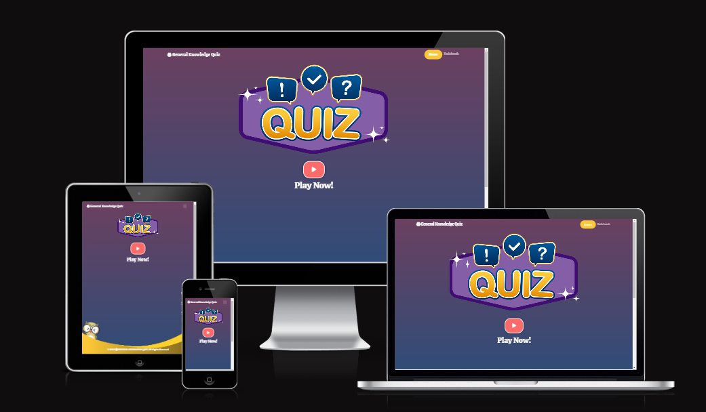
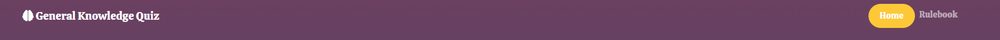
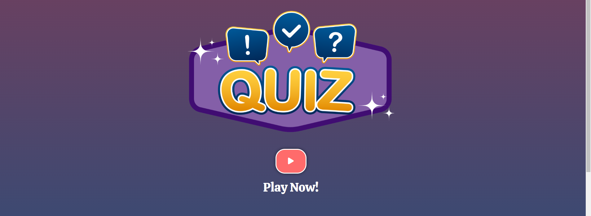
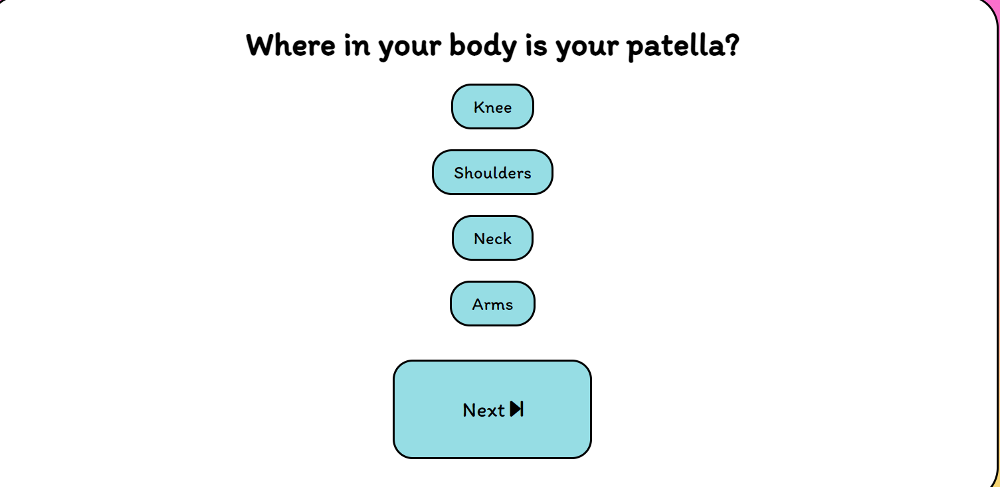
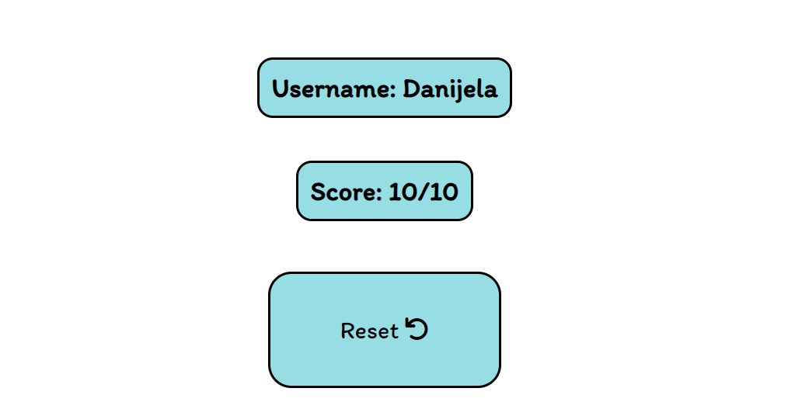
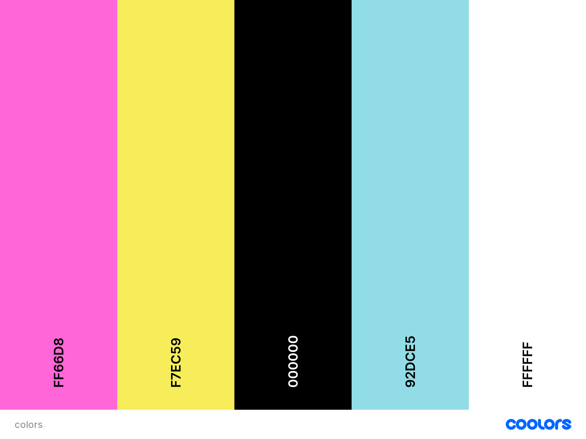
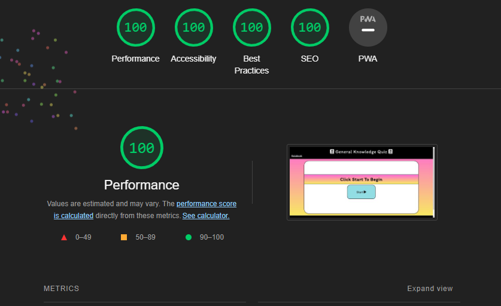
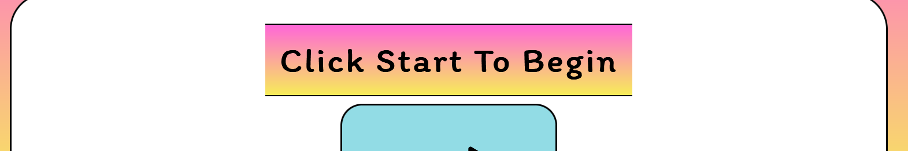

# General-Knowledge-Quiz
- This project was made as a part of a Full Stack Developer Programme by Code Institute. All information contained on the page is intended for course use only.
[View the live project here.](https://marosan28.github.io/general-knowledge-quiz/)
-----
## Who is this website for and what does it do? 

- General Knowledge Quiz is an interactive website made for anyone who wants to have fun and test their knowledge. 
Website's main goal is entertaining the user and encouraging the user to play. The website is targeted towards everyone above 10 years of age. General Knowledge Quiz offers the User a fun way to learn and/or improve their knowledge.
-----

## Main Features
- __Navigation__

  - The front page consists of a navigation bar at the top where a user can see the name of the quiz and a logo and a Rulebook on the right side of the navbar where a user can check the rules of the game.
  

- __Landing Page__

  - The landing page consists of a main animated hero image and a button to start the game.
    - There is a text line "Play now!" which calls the user to click on the button to start the game.

- __Footer__

  - The footer is on the bottom of the page it contains general information of which year the quiz was made.
    

- __Username and Score__

  - There is a username and score tracker on the top of the page.
    -The username and score are both in contrast colored boxes to make them stand out more, make the game more enjoyable and easier to follow.
    

- __Question Box__

  - Questions are presented in a clear way and also bolded.
  - Answers each have their own box, on each question there are 4 possible answers.
  - Next button at the bottom, where the User can click to continue on to the next question.
    

- __Finished Game__

  - At the end of the game the User can see the score achieved along with his username.
  - There is a restart button to start the game from the beginning.

 ## First Time Visitor Goals
-   ### User stories

    -   #### First Time Visitor Goals

        1. As a First Time Visitor, I want to easily understand the main 
        purpose of the site.

        2. As a First Time Visitor, I want to be able to easily navigate throughout the website layout.

        3. As a First Time Visitor, I want to be able to understand the questions and how can I respond to them. 

    -   #### Returning Visitor Goals

        1. As a Returning Visitor, I want to be able to play with different usernames.
        2. As a Returning Visitor, I want to see my result while playing.
        

    -   #### Frequent User Goals
        1. As a Frequent User, I want to have my username saved.
        2. As a Frequent User, I want to be able to check the rules at any moment while playing.

-   ### Design
    -   #### Colour Scheme
        -   The colour palette used on this website is: 

            

            The colours chosen for this project are #FF66D8 and #F7EC59 in the background, and #92DCE5 for the buttons. Background colors are vibrant and are known to evoke a sense of warmth, joy, fun, and energy. The button color is associated with tranquility and softness. 
            The colour palette was generated by [Coolors website](https://coolors.co/)

    -   #### Typography
        -   The *Itim* font is the main font used throughout the whole website with Sans Serif as the fallback. *Itim* is a handwritten font in a cartoon style, it feels lighthearted and childlike, thereafore makes content appear more fun.
              *   ### Wireframes

    -   Landing Page Wireframe - [View](wireframes/images/landing-page-wireframes.jpg)

    -   Question Page Wireframe - [View](wireframes/images/question-page-wireframes.jpg)

    -   Final Page Wireframe - [View](wireframes/images/final-page-wireframes.jpg)
## Technologies Used

### Languages Used

-   [HTML5](https://en.wikipedia.org/wiki/HTML5)
-   [CSS3](https://en.wikipedia.org/wiki/Cascading_Style_Sheets)
-   [JS](https://en.wikipedia.org/wiki/JavaScript)

### Frameworks, Libraries & Programs Used

1. [Google Fonts:](https://fonts.google.com/)
    - Google fonts was used to import the 'Itim' font into the style.css file which is used on all pages throughout the project.
1. [Font Awesome:](https://fontawesome.com/)
    - Font Awesome was used on all pages throughout the website for the logo headline and icons on the buttons.
1. [JavaScript:](https://javascript.com/)
    - JavaScript was the main technology used for this quiz.
1. [Git](https://git-scm.com/)
    - Git was used for version control by utilizing the Gitpod terminal to commit to Git and Push to GitHub.
1. [GitHub:](https://github.com/)
    - GitHub is used to store the projects code after being pushed from Git.
1. [Miro:](https://balsamiq.com/)
    - Miro was used to create the wireframes during the design process.
  ## Testing

The JSHint, W3C Markup Validator and W3C CSS (Jigsaw) Validator Services were used to validate every page of the project to ensure there were no syntax errors in the project.

-   [W3C Markup Validator](https://jigsaw.w3.org/css-validator/#validate_by_input) - [Results](wireframes/images/html-validator.png)
-   [W3C CSS Validator](https://jigsaw.w3.org/css-validator/#validate_by_input) - [Results](wireframes/images/css-validator.png)
-   [JSHint](https://jshint.com/)- [Results](wireframes/images/jshint.png)
### Acessibility
- Google Lighthouse
-   Website was tested using [Google Chrome Lighthouse](https://developers.google.com/web/tools/lighthouse)

  
### Testing User Stories from User Experience (UX) Section

-   #### First Time Visitor Goals

    1. As a First Time Visitor, I want to easily understand the main purpose of the site.

        1. When entering the site the User can clearly see the title at the top of the page at the navigation bar.
        2. There is a large start button with an icon at the centre of the page. 
        3. Above the start button there is an instruction "Click to start the game", the User knows he can click on the button and will be redirected to start the game.

    2. As a First Time Visitor, I want to be able to easily navigate throughout the website layout.

        1. The site has been designed with a navigation bar at the top of the page which clearly states the name of the Quiz.
        2. There is a Rulebook hyperlink in the left corner of the navigation bar which is underlined, when User hovers over the hyperlink it changes the mouse to pointer indicating it should be clicked.
        3. There is a footer at the bottom of the page which states when was the website created.

    3. As a First Time Visitor, I want to be able to understand the questions and how can I respond to them.

        1. Every question is presented in a clear way at the middle of the page with bold text style, the answers are in a column presented below the question
        2. Each question has it's own blue box, hovering over the question the box has a transition and changes the mouse to pointer, the User knows it's clickable.

-   #### Returning Visitor Goals

    1. As a Returning Visitor, I want to be able to play with different usernames.

        1. After the user clicks on start he will be able to add the username he wants to play the game with.
        2. The username resets after each game, the user can set up different usernames when starting the game from the beginning.

    2. As a Returning Visitor, I want to see my result while playing.

        1. Above the questions box there are two boxes in the middle of the screen, one is the Users selected username and the other one is the current score.
        2. The score updates throught the game.

-   #### Frequent User Goals

    1. As a Frequent User, I want to have my username saved.

        1. The username User used stays on the website and when starting a new game the user can select the same username again.
     
    2. As a Frequent User, I want to be able to check the rules at any moment while playing.

        1. The rulebook is at the navigation bar and accessible to the User at all times during the game.
### Further Testing

-   The Website was tested on Google Chrome, Opera and Mozzila Firefox.
- The website was tested on Google Pixel 4a, Huawei P30 lite and Iphone 6s.

### Bugs

-Bug on Mozzila Firefox 
 
- The bug was fixed, added /*width: -moz-available;*/ to CSS code.

## Deployment

### GitHub Pages

To deploy the site to Github pages the following steps should be followed: 

1. Log in to GitHub and locate the [GitHub Repository](https://github.com/)
2. At the top of the Repository (not top of page), locate the "Settings" Button on the menu.
3. Scroll down the Settings page until you locate the "GitHub Pages" that now has it's own dedicated tab.
4. Under "Source", click the dropdown called "None" and select "Master Branch".
5. The page will automatically refresh.
6. The link to your page will now show up with "Your site is published at:" 

### Forking the GitHub Repository

Forking the GitHub Repository means we make a copy of the original repository on our GitHub account to view and make changes without affecting the original repository by using the following steps...

1. Log in to GitHub and locate the [GitHub Repository](https://github.com/) you want to fork.
2. At the top of the Repository (not top of page) just above the "Settings" Button on the menu, you will see a fork button.
3. Click on the button to create a copy. 
4. You should now have a copy of the original repository in your GitHub account.

### Making a Local Clone

1. Log in to GitHub and locate the [GitHub Repository](https://github.com/) you want to deploy.
2. Under the repository name, click "Clone or download".
3. To clone the repository using HTTPS, under "Clone with HTTPS", copy the link.
4. Open Git Bash in your IDE.
5. Change the current working directory to the location where you want the cloned directory to be made.
6. Type `git clone`, and then paste the URL you copied.
7. Press enter and the clone should be created.
## Credits

### Content

- The questions for the quiz were found [here](https://thoughtcatalog.com/wp-content/uploads/2020/03/best-trivia-questions.pdf)

### Acknowledgements

-   Slack student support.

-   [Academind](https://www.youtube.com/c/Academind) for all the tutorials that helped me throughout the project.

