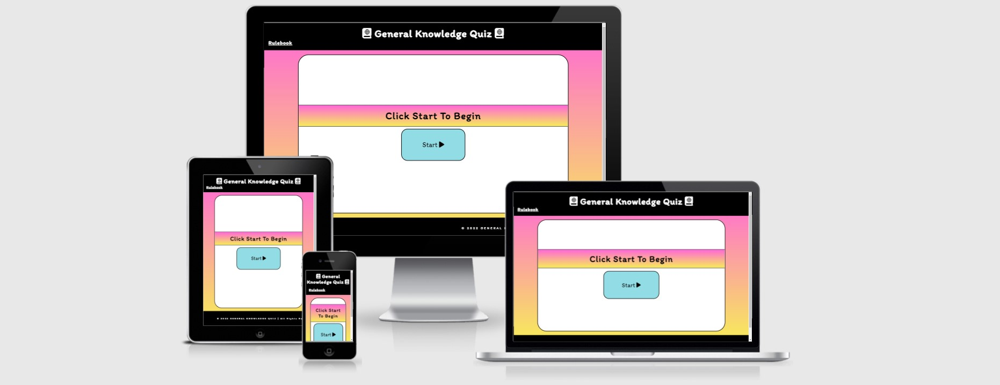

# General-Knowledge-Quiz
- This project was made as a part of a Full Stack Developer Programme by Code Institute. All information contained on the page is intended for course use only.
[View the live project here.](https://marosan28.github.io/general-knowledge-quiz/)
-----
## Who is this website for and what does it do? 

- General Knowledge Quiz is an interactive website made for anyone who wants to have fun and test their knowledge. 
Website's main goal is entertaining the user and encouraging the user to play. The website is targeted towards everyone above 10 years of age. General Knowledge Quiz offers the User a fun way to learn and/or improve their knowledge.
-----

## Main Features
- __Navigation__

  - The front page consists of a navigation bar at the top where a user can see the name of the quiz and a logo and a Rulebook on the left of the screen where a user can check the rules of the game.
  

- __Landing Page__

  - The landing page consists of a main white box where all the content is and the start button.
    - There is a text line "Click Start To Begin" which tells the user to click on the button to start the game.

- __Footer__

  - The footer is on the bottom of the page it contains general information of which year the quiz was made.
    

- __Username and Score__

  - There is a username and score tracker on the top of the page.
    -The username and score are both in contrast colored boxes to make them stand out more, make the game more enjoyable and easier to follow.
    

- __Question Box__

  - Questions are presented in a clear way and also bolded.
  - Answers each have their own box, on each question there are 4 possible answers.
  - Next button at the bottom, where the User can click to continue on to the next question.
    

- __Finished Game__

  - At the end of the game the User can see the score achieved along with his username.
  - There is a restart button to start the game from the beginning.

 ## First Time Visitor Goals
-   ### User stories

    -   #### First Time Visitor Goals

        1. As a First Time Visitor, I want to easily understand the main 
        purpose of the site.

        2. As a First Time Visitor, I want to be able to easily navigate throughout the website layout.

        3. As a First Time Visitor, I want to be able to understand the questions and how to respond. 

    -   #### Returning Visitor Goals

        1. As a Returning Visitor, I want to be able to play with different usernames.
        2. As a Returning Visitor, I want to see my result while playing.
        

    -   #### Frequent User Goals
        1. As a Frequent User, I want to have my username saved.
        2. As a Frequent User, I want to be able to check the rules at any moment while playing.

-   ### Design
    -   #### Colour Scheme
        -   The colour palette used on this website is: 

            

            The colours chosen for this project are #FF66D8 and #F7EC59 in the background, and #92DCE5 for the buttons. Background colors are vibrant and are known to evoke a sense of warmth, joy, fun, and energy. The button color is associated with tranquility and softness. 
            The colour palette was generated by [Coolors website](https://coolors.co/)

    -   #### Typography
        -   The *Itim* font is the main font used throughout the whole website with Sans Serif as the fallback. *Itim* is a handwritten font with

        ## Deployment

### GitHub Pages

To deploy the site to Github pages the following steps should be followed: 

1. Log in to GitHub and locate the [GitHub Repository](https://github.com/)
2. At the top of the Repository (not top of page), locate the "Settings" Button on the menu.
3. Scroll down the Settings page until you locate the "GitHub Pages" that now has it's own dedicated tab.
4. Under "Source", click the dropdown called "None" and select "Master Branch".
5. The page will automatically refresh.
6. The link to your page will now show up with "Your site is published at:" 

### Forking the GitHub Repository

Forking the GitHub Repository means we make a copy of the original repository on our GitHub account to view and make changes without affecting the original repository by using the following steps...

1. Log in to GitHub and locate the [GitHub Repository](https://github.com/) you want to fork.
2. At the top of the Repository (not top of page) just above the "Settings" Button on the menu, you will see a fork button.
3. Click on the button to create a copy. 
4. You should now have a copy of the original repository in your GitHub account.

### Making a Local Clone

1. Log in to GitHub and locate the [GitHub Repository](https://github.com/) you want to deploy.
2. Under the repository name, click "Clone or download".
3. To clone the repository using HTTPS, under "Clone with HTTPS", copy the link.
4. Open Git Bash in your IDE.
5. Change the current working directory to the location where you want the cloned directory to be made.
6. Type `git clone`, and then paste the URL you copied.
7. Press enter and the clone should be created.
