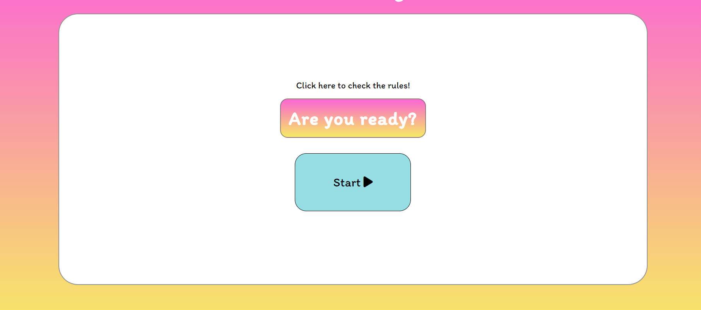

# General-Knowledge-Quiz
- This project was made as a part of a Full Stack Developer Programme by Code Institute. All information contained on the page is intended for course use only.
-----
## Who is this website for and what does it do? 

- General Knowledge Quiz is an interactive website made for anyone who wants to have fun and test their knowledge. 
Website's main goal is entertaining the user and encouraging the user to play. The website is targeted towards everyone above 10 years of age. General Knowledge Quiz offers the user a fun way to learn and improve their knowledge.
-----
## Main Features
- __Front Page__

  - The front page consists of a title at the top that tells the user the name of the quiz.
  

- __Landing Page__

  - The landing page consists of a white box, a hyperlink to check the rules is apparent and the Start button.
    - The hyperlink underlines on the hover and the start button changes size, the mouse also changes to pointer, it's easy for user to know where to click for relevant information.

 ## First Time Visitor Goals
-   ### User stories

    -   #### First Time Visitor Goals

        1. As a First Time Visitor, I want to easily understand the main 
        purpose of the site.

        2. As a First Time Visitor, I want to be able to easily navigate throughout the website layout.

        3. As a First Time Visitor, I want to be able to understand the questions and how to respond. 

    -   #### Returning Visitor Goals

        1. As a Returning Visitor, I want to be able to play with different usernames.
        2. As a Returning Visitor, I want to see my result while playing.
        

    -   #### Frequent User Goals
        1. As a Frequent User, I want to have my username saved.
        2. As a Frequent User, I want to be able to check the rules at any moment while playing. 